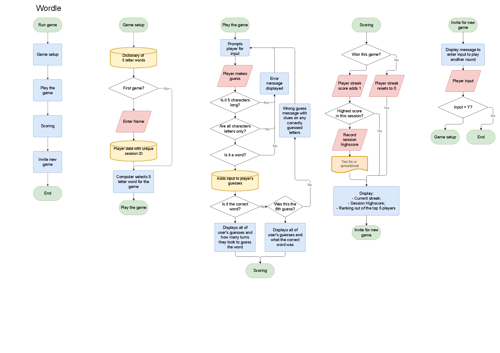
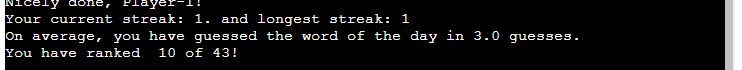

# Wordle game
For my third portfolio project with Code Institute I built a python game based on a game I play everyday, **Wordle**.

I will recreate a version of the game to be played on a Command-Line Interface (CLI) coded with python.

**Wordle** is a word game of deduction.

Players are given 6 chances to guess the 5-letter word of the day. 
With each guess, the web-based game indicates whether any of the letters used are in the word of the day and whether they are in the correct place. 
Should the player deduce the word of the day, the game tracks the winning streak as the player wins consecutive days.
If the player misses a day or fails to guess the word, the winning streak is broken and the score resets to 0.

[View the deployed webapp here](https://wordle-dasic002-367fb61feaeb.herokuapp.com/)

## UX - User Experience

### User stories
#### First time player
- Upon visiting the site the first time want to have the option to skip reading the intructions and proceed straight with the game.
- I want to be able to refer to the instructions mid play without losing the current state of my game.

#### An experienced Wordle player introduced to this version
- I want the gameplay to be as accurate to the offical game, this means:
  1) Appearance - the game is similar enough to the official game that it is easy to pick up.
  2) Gameplay - being able to see what guesses have been made for reference in the next guess.
  3) Stats - track my progress, I want to use this game to improve my skill in the offical game.

#### Returning player
- I want to be able to play the game on any device, be it a desktop PC or my mobile.
- Want to share my stats with friends.
- Want to be able to return to my game to resume

### Flowchart
To plan and illustrate how the game will run, I have generated this flowchart.

### Strategy

Start with an MVP and build on desirable features, to create a simplistic, fun and addictive version of the wordle game that is easy to follow on a CLI display.

### Scope

__Must have features:__
- Word bank of 5-letter words in US english.
- Randomly select the word to guess.
- Allow player to enter up to 6 guess and provide basic feedback on letters correctly guessed, differentiating placement from inclusion.
- Reveal the selected word in case the player has not guessed the word.
- Validation on player input, that the input is:
  - 5 characters long.
  - all letters.
  - a word present in the dictionary.

__Should have:__
- Tracking of scores in the session to feedback to player.
- Invite the player to play another game.
- Clean GUI, using colours rather than symbols for feedback on guesses. Selecting colours that are as accessible for colour blind users too.
- Rules explaning how to play the game. 

__Could have:__
- Save session scores in a database to provide feedback to user on how do they compare against other players.
- Provide an optional breakdown of the player's scores.
- Resume sessions, the game could be made to allow the user to enter their given ID to resume winning streak count.
- Praise from the game matching that of wordle, which depends on how many guesses made before finding the selected word.

__Won't have:__
- Mobile phone or tablet access, the CLI does not seem to accept text entered on these devices and any solutions online don't seem straightforward or universal.

### Surface
#### Colour theme
Considering the limitations in the CLI for colour and formatting, I followed the appearance of wordle in dark mode with some consideration for accessibility for colour blind users.

Originally, the chosen colours were green for correctly guessed letters, dark purple for wrong placement of letters and grey for not existent. This provided an optimum contrast between any colour when run through a simulator.

However, the chosen colours, used an 8-bit configuration in the ANSI escape code, once the code was deployed to Heroku, the terminal did not display any of this formatting.

Being constricted to 3-bit and 4-bit palette, it took a few deployments to test the colour the CLI would output. 

Firstly, attempted using the closest colours available, which unfortunately meant the purple/magenta available was too close to the grey being used and produced a low contrast. 

 

Eventually, a version of the code was deployed that printed out all colours available so we could pick the RGB values and use Adobe Colour to see which might work best for the various types of colour blindness. It was found that the bright yellow, standard green and a darker grey was most suitable.

 

## Features 

### Existing Features
#### Welcome
Upon the game loading, the terminal will display a simple Heading "Welcome to Wordle", with only a prompt at the bottom of the interface for the user to enter their name. This is to keep the interface as simply and least daunting as possible before the player begins the game. 
  

#### New game display
Once the player has input a name the terminal generates the user variables and word selection and presents the game in the CLI after clearing the welcome display away.

__Note:__ If the play simply pressed enter without entering a name, the game will use the default of "Player-1".

The display will include:
  1) a personalised message of "Welcome, _player name_".
  2) an instructions how to bring up the rules of the game.
  3) blank guess lines shown as a series of asterisks __` *  *  *  *  * `__.
  4) prompt for player to enter their guess. 
  

  
#### Player Prompt
The game prompts the player to take a guess, provided it passes the validation checks, the game checks the input guess against the randomly selected word for this session. Every time the guess is incorrect the prompt changes to "Oops! That guess is wrong. You have {number} of guess(es) left.".

#### Invalid guess inputs display
To reduce frustrations over incorrect guesses we have put in place some input validations, as well as adding a `strip()` method to the guess input so should the user enter a whitespace before or after typing their word, it will not trigger the validation checks for a seemingly valid guess.

##### Invalid data: not exactly 5 characters long
This first check verifies the guess is only 5 characters long, not shorter or longer. In the chance the player enters a guess that fails this check the game prints out the game display again but with the message advising the guess was invalid and explaining why so.

##### Invalid data: includes characters not in the alphabet
Should the guess input pass the 5 characters long verification, the next check verifies that no characters other than letters in the alphabet have been used. Should the player enter punctuation marks, numbers or other special characters, the game will refresh and display the error message explaining why the last entered guess was not valid.

##### Invalid data: is not a word in the dictionary used
Finally, after passing the other checks, the last check verifies that the input is a word included in our dictionary. Should it not be included in the dictionary, it will refresh the game and advise the word is not in the dictionary.

#### Clues on guesses made
The objective of wordle is that the player gets given clues on all guesses so the player can deduce what the selected word is. In our version of the game:
- Blank lines are shown as plain text asterisks ` * `.
- Letters not existing in the selected word are shown in a dark grey background - these tell the player to avoid using these letters in future guesses.
- Letters existing in the selected word but in the incorrect place are shown in a bright yellow background - these tell the player to try words where this letter is in another place.
- Letters existing in the selected word and in the correct place are shown in a green background - these tell the player to try words where this letter is as it is.

#### End of Round
The round ends when the player has either guessed the selected word or has failed to do so after 6 attempts.
##### Correct guess
On guessing the word, the terminal prints out "Nicely done, _player name_!" and confirms the word of the day.

##### 6 Wrong guesses
On 6 failed attempts, the terminal prints out "GAME OVER", reveals the word of the day and "Oh no, _player name_! You've lost this streak!".

##### Scores
In either case the game will keep track of the score, namely the consequitive number of times the player has guessed the word correctly. Should it be the maximum the player has managed to get in this session, the game will record it as a higscore. Should the player, win the game, the "Current streak" counter increments by 1, if the game was lost, it resets to 0.

The game will also calculate and display the average number of guesses the player has needed to guess the word of the day. It will also lookup the player's longest winning streak and rank the player against the other game sessions recorded.

##### Inviting for a new game
At the end of the round, the game prompts the player for another game. If the player inputs anything but "n" or "N", a new round will start with a new word of the game. Should the player have had enough, they'll enter "n" or "N" for No to exit the game. On doing so a message thanking the player for playing will be printed out.

#### Game rules display
Should the player need to be reminded of the rules, the player can enter "help!" as a guess input. This will bypass the usual validations and cause the game to print the rules on a clear terminal and request a prompt just to press 'Enter' when done with the game for when the player feels ready to resume the game.

### Features Left to Implement
These features were not implemented just so I did not get distracted with a feature creep and not deliver on my MVP.

#### __Alphabet checklist__
The official Wordle game includes the whole keyboard in the display, highlighting which letters have not been used, which are non existing in the word of the day and existing or correctly placed. This helps the player visualise which letters they could use on their next guess much like a checklist of the alphabet. It becomes easier to try sounding out words for the next guess without using the letters the game has rules out. 

__How might we create this?__
We have not recreated this feature, but we could potentially use the empty space to the right of the guesses to print out the alphabet and highlighting what letters are still available to use. This would probably be done as dictionary variable, where the alphabet forms the keys and the values are the same as used for listing out the clues in a guess ('-' for unused/unchecked, 'X' for not in word of the day, 'O' for exist in Word of the day, 'C' is in the correct place of the word of the day).

#### __Hard Mode gameplay__
Wordle includes __Hard Mode__ which tracks letters the player has guessed that exist in the selected word and should the player not use them in the next guess they attempt, wordle will not accept the entry. Should the letter be in the correct place, wordle will only accept words with the correctly guessed letters in the same places. 

For example, should the word of the day be __LIVER__ and:
1) the first guess be __PLATE__, then __L__ and __E__ are indicated as exiting but being in the wrong place, the second guess would need to include both __L__ and __E__, so it could __not__ be something like _NERVE_ or _LOUSY_, but could be _LIKED_ or _LOVER_.
2) Should the second guess in fact be __LIKED__, the letters __L__, __I__ and __E__ will be indicated as correctly guessed and need to be used in the same places for the following guess, something looking like __L I _ E _.__, which could be LIFER, LIMEN, LINEN, LINER, LIVED, LIVER just to name a few. 

The aim of this feature is to avoid the player trying completely different words in order to find other missing letters without the constraints of considering the words that the word of the day could be with the clues given. For instance, without __Hard Mode__ the player's second guess could be __VIRUS__ (after 1st as __PLATE__), it doesn't include __L__ and __E__ that would have been highlighted from _PLATE_, but does include __V__, __I__ and __R__. 

From those 2 guesses, the player should be able to deduce that the word of the day is __LIVER__ on the third guess. 

__How might we create this?__
If we were to implement this feature we could store the list output from the evaluation of previous guesses to use in a validation of input and comparing the previously correct guessed letter placement matching that in the new guess. 
For letters existing in the selected word, the function evaluating guesses can output a dictionary of these letters, and the input validation checks that these letters are used in the latest input before it proceeds to evaluating for the game. 

#### __Feedback messages__
Wordle has a feedback word for correctly guessing the word of the day at each attempt. Specifically, the following messages display guessing correctly at:
1) first attempt - __Genius__
2) second attempt - __Magnificent__
3) third attempt - __Impressive__
4) fourth attempt - __Splendid__
5) fifth attempt - __Great__
6) sixth attempt - __Phew__

__How might we create this?__
This messages could have been a constant variable as a list and upon winning the round, the message is composed calling the list item by index. The index would be calculated with the length of the list of guesses made minus 1.

#### __Returning players login__
Playing the official Wordle game the game recognises the devices, so as the player returns day after day it is able to track the player's stats. For extended features, players can register an account with New York Times to access other games too. The benefit is that a returning player can keep building on their winning streak to overcome their own highscore (longest streak) without having to play more rounds in one single session of accessing the game.

__How might we create this?__
The most feasible way I can think of is to either:
- provide new players their timestamp based ID after entering their name so that next time they access the game, if it is entered in the name prompt of the welcome page, the game can recognise the input is all numeric and 12 digits long, which makes the game lookup the number as an ID, if it existts in our worksheet it will pull the data into the game and allow the next round, if won to increment the current winning streak as if the player had not closed the previous game.
- or that when new players enter their name on the welcome page prompt, the game asks the player to provide a unique username and password, with the game confirming that the username is valid and available in the worksheet. Next time the player returns, when prompted for a name, the player can enter their username, the game looks up the usernames in the worksheet and prompts for a password, before it resumes the game with the same stats. 

## Technologies
- Languages used:
  - [Python](https://en.wikipedia.org/wiki/Python_(programming_language))
- [Draw.io](https://app.diagrams.net/#) - a free web-based diagram drawing tool.
- [GitPod](https://www.gitpod.io/) - Cloud-based IDE to edit code and Git version control.
- [GitHub](https://github.com/) - to store and publish the project.
- [Am I Responsive](https://ui.dev/amiresponsive) - to visualise the website in various display sizes.
- [Adobe Color](https://color.adobe.com/create/color-wheel) - to generate the colour palette and Accessibility tools checking for contrast for legibility and colour-blind viewing.
- [PEP8 guide](https://peps.python.org/pep-0008/) - for guidance on python formatting standards. 
- [Code Institute's Python linter](https://pep8ci.herokuapp.com/) - to validate the Python code. 
- [Heroku](https://dashboard.heroku.com/) - for deplayment of our web app.
- [Pilestone - Color Blind Vision Simulator](https://pilestone.com/pages/color-blindness-simulator-1)

## Testing 

### Validator Testing 

- [Code Institute's Python linter](https://pep8ci.herokuapp.com/) - to validate the Python code. 
- Accessibility:
  - Adobe colour - [colour blindness](https://color.adobe.com/create/color-accessibility) - No conflicts found. 
  
  - [Pilestone - Color Blind Vision Simulator](https://pilestone.com/pages/color-blindness-simulator-1) - visual check, seems distinguishable still 
  - [simulated colourblind viewing images here](documentation/simulated_colourblind/)

### Manual Testing

#### Devices and browsers used
- iPhone 12 Pro and iPad Pro (12.9 inch - 4th Gen)
  - IGNORED: given the CLI terminal via the web browser on these devices did not accept any keyboard entries.

- Dell Precision 3510 laptop - Windows 10 Pro (2H22)
  - Chrome (v128)
  - Firefox (v129)
  - Microsoft Edge (v128)

#### Manual testing checklist

| Feature | Action | Expected Behaviour | Pass/Fail | Notes |
|-|-|-|-|-|
|Heroku App loads with no errors|Open web app|CLI loads to the welcome page, prompting user for name|PASS|
|Automatic name given|Press enter without typing a name|Game prints out "Welcome Player-1"|PASS|
|Player name is registered|Enter a name on welcome page|See player name repeated back in "Welcome {player name}"|PASS|
|Player data is created and recorded in worksheet|Enter a name on welcome page|See player name and data added on new line in the worksheet|PASS|
|Game play - 1st view|Loading after name input|Terminal prints: Welcome message, including how to access rules. Blank lines for missing guesses are rendered. Prompt asking for a guess.|PASS|
|Game play - clues on guesses|Loading after guess input|Prints the last guess in one of the previously blank lines and renders any correctly guess letters: Bright Yellow if exists but not in the correct place. Green if it matches place as well.|PASS|
|Game play - display after a guess|Loading after guess input|Terminal prints: Same welcome message, including how to access rules. Prints the last guess in one of the lines and renders with clues. Blank lines for missing guesses are rendered.|PASS|
|Game play - display after a wrong guess|Loading after guess input|Prints a message advising the guess was incorrect, how many chances there are left and prompts player for another guess.|PASS|
|Game play - display after a correct guess|Loading after guess input|Prints a message advising the guess was Correct. Prints current game data and prompts player for another game.|PASS|
|Game play - display after running out of guesses|Loading after 6 incorrect guess inputs|Prints a message advising the game is over and what was the word selected. Resets the current streak to 0, whilst longuest streak remains as the longest achieved in this session. Prints current game data and prompts player for another game.|PASS|
|Game play - INVALID guess input - not 5 characters|Loading after a guess input either shorter or longer than 5 characters|Prints message error message advising the guess must be 5 chars long and length entered. Ignoring any leading or following spaces around the word.|PASS|
|Game play - INVALID guess input - not all alphabetic characters|Loading after a guess input has either numeric or special/punctuation characters|Prints message error message advising the guess must contain letters only. Ignoring any leading or following spaces around the word.|PASS|
|Game play - INVALID guess input - not a word in the dictionary|Loading after a guess input is not a word in the dictionary used|Prints message error message advising the guess must match a word in the dictionary. Ignoring any leading or following spaces around the word.|PASS|
|Rules of the game - opening|Enter "help!" as a guess|Terminal prints out the rules and waits for the enter key to be pressed to return back to the game.|PASS|
|Rules of the game - closing|Press the enter key|Terminal prints to display the game again as it was left.|PASS|
|Scoring - tracks current streak|On winning rounds|increments current streak|PASS|
|Scoring - tracks highscore correctly|on winning and losing rounds|it retains the highest number of winning streaks in the session|PASS|
|Scoring - calculates average correctly|on winning rounds|calculates the avergae number of guesses taken in winning rounds|PASS|
|Prompt to play another game - play again|Press the enter key|Terminal print a new game, back to displaying the 6 blank lines ready to guess a new word.|PASS|
|Prompt to play another game - exit the game|Input "n" or "N" and press the enter key|Terminal prints a goodbye message to the player|PASS|

### Bugs

- __ANSI escape 8-bit colours not visible on Heroku - FIXED__ 
Heroku allows for colours in it's app, but these are restricted to 3-bit and 4-bit, so have selected colours from that selection instead.

- __Dictionary includes words with the character "ƒ" - FIXED__ 
This character appeared on words that should have ended with an accented e (é), like __sauté__. For ease of playing the game this character has been replaced with a plain "e".

## Deployment as a Heroku app

1) Login to Heroku.
2) Once on the dashboard, click _"New"_ and select _"Create new app"_ from dropdown list.
3) Select the applicable region for your app. In our case, it's _Europe_.
4) Give the app a name. _NOTE:_ the form will advise if the name is unique and therefore available.
5) Once a suitable name has been given, click _"Create app"_.
6) You should be directed to the __"Deploy"__ tab of the app. Here you'll see a __"Deployment method"__ section, select __"GitHub"__.
7) Another section should reveal __"Connect to GitHub"__, if you have connected your GitHub account, you should see your account listed and search bar to find the repository to deploy from. Click __"Search"__ and click __"Connect"__ on the correct repository listed below.
8) Before we proceed with deployment further, we need to navigate to the __"Settings"__ tab.
9) Expand Config Vars by clicking __"Reveal Config Vars"__, and add a key of `PORT` with a value of `8000`.
10) If your project contains credentials to access secure data, you'll need to add another Config Var, add a key of `CREDS` and paste the JSON content as the value.
11) Next, we need to add two buildpacks, note the order is __important__, select and add buildpack as follows:

1. `heroku/python`
2. `heroku/nodejs`

12) Navigate back to the __"Deploy"__ tab, scroll down to __"Manual deploy"__, select the appropriate branch and click __"Deploy Branch"__. This step take short while for the server to compile the code and dependencies for the app.

To view the deployed app, scroll to the top and click "Open app".

The deployed app can be found [here.](https://wordle-dasic002-367fb61feaeb.herokuapp.com/)

### Constraints

The deployment terminal is set to 80 columns by 24 rows. That means that each line of text needs to be 80 characters or less otherwise it will be wrapped onto a second line.

### Branching

<!-- This current branch, is the main branch being submitted for grading, it only differs from the pre-submission-archive branch in that it holds no debug code in the JavaScript file. -->

## Credits 

### Media
- [Am I Responsive](https://ui.dev/amiresponsive) - to visualise the website in various display sizes as the preview used in this readme file.
- [Pilestone - Color Blind Vision Simulator](https://pilestone.com/pages/color-blindness-simulator-1) - used to generate the view of colour blind conditions of the CLI based game.

### Code

- Reference for clearing the screen in python - [Clearing Screen in Linux Operating System](https://www.geeksforgeeks.org/clear-screen-python/)
- Reference for multiline string to print "pages" - [Multiline Strings](https://www.w3schools.com/python/gloss_python_multi_line_strings.asp)
- Reference for readlines() method to list words - [readlines() Method](https://www.w3schools.com/python/ref_file_readlines.asp)
- Validating input - [Love Sandwiches - Validating our data part 1](https://learn.codeinstitute.net/courses/course-v1:CodeInstitute+LS101+1/courseware/293ee9d8ff3542d3b877137ed81b9a5b/c92755338ef548f28cc31a7c3d5bfb46/?child=first)
- Reference for alphabetic chars only in a string - [String isalpha() Method](https://www.w3schools.com/python/ref_string_isalpha.asp)
- Reference to check value exists in list - [Check If List Item Exists](https://www.w3schools.com/python/gloss_python_check_if_list_item_exists.asp)
- Reference for while loop until valid data - [Creating our User Request Loop](https://learn.codeinstitute.net/courses/course-v1:CodeInstitute+LS101+1/courseware/293ee9d8ff3542d3b877137ed81b9a5b/c92755338ef548f28cc31a7c3d5bfb46/?child=first)
- Reference for centering text in string - [String center() Method](https://www.w3schools.com/python/ref_string_center.asp)
- Reference to create dictionary comprehensions - [Dictionary comprehensions](https://learn.codeinstitute.net/courses/course-v1:CodeInstitute+CPP_06_20+3/courseware/f780287e5c3f4e939cd0adb8de45c12a/82a59be9f20a4f36bff58ff4a102d60a/)
- Formatting text - [How do I print colored text to the terminal?](https://stackoverflow.com/questions/287871/how-do-i-print-colored-text-to-the-terminal)
- ANSI colours - [ANSI escape code](https://en.wikipedia.org/wiki/ANSI_escape_code#3-bit_and_4-bit)
- Reference for Datetime to use in creating a timestamp based ID - [Datetime](https://learn.codeinstitute.net/courses/course-v1:CodeInstitute+CPP_06_20+3/courseware/272f493b4d57445fbd634e7ceca3a98c/4ab3e01af44f4bf2828739c1d0591a45/) and [formatting](https://www.w3schools.com/python/python_datetime.asp#gsc.tab=0)
- Reference for getting values from a dictionary - [values()](https://www.w3schools.com/python/ref_dictionary_values.asp)
- Reference for returning a sum of integers in a list - [math.fsum()](https://www.w3schools.com/python/ref_math_fsum.asp)
- Reference for setup, finding and updating spreadsheet with [gspread](https://docs.gspread.org/en/latest/user-guide.html)

### Acknowledgement
- My mentor Brian Macharia for his insight, guidance and words of encouragement.

<!--## Other General Project Advice

 Below you will find a couple of extra tips that may be helpful when completing your project. Remember that each of these projects will become part of your final portfolio so it’s important to allow enough time to showcase your best work! 

- One of the most basic elements of keeping a healthy commit history is with the commit message. When getting started with your project, read through [this article](https://chris.beams.io/posts/git-commit/) by Chris Beams on How to Write  a Git Commit Message 
  - Make sure to keep the messages in the imperative mood 

- When naming the files in your project directory, make sure to consider meaningful naming of files, point to specific names and sections of content.
  - For example, instead of naming an image used ‘image1.png’ consider naming it ‘landing_page_img.png’. This will ensure that there are clear file paths kept. 

- Do some extra research on good and bad coding practices, there are a handful of useful articles to read, consider reviewing the following list when getting started:
  - [Writing Your Best Code](https://learn.shayhowe.com/html-css/writing-your-best-code/)
  - [HTML & CSS Coding Best Practices](https://medium.com/@inceptiondj.info/html-css-coding-best-practice-fadb9870a00f)
  - [Google HTML/CSS Style Guide](https://google.github.io/styleguide/htmlcssguide.html#General)

Getting started with your Portfolio Projects can be daunting, planning your project can make it a lot easier to tackle, take small steps to reach the final outcome and enjoy the process!  -->

<!-- 

Welcome,

This is the Code Institute student template for deploying your third portfolio project, the Python command-line project. The last update to this file was: **May 14, 2024**

## Reminders

- Your code must be placed in the `run.py` file
- Your dependencies must be placed in the `requirements.txt` file
- Do not edit any of the other files or your code may not deploy properly

---

Happy coding! -->
